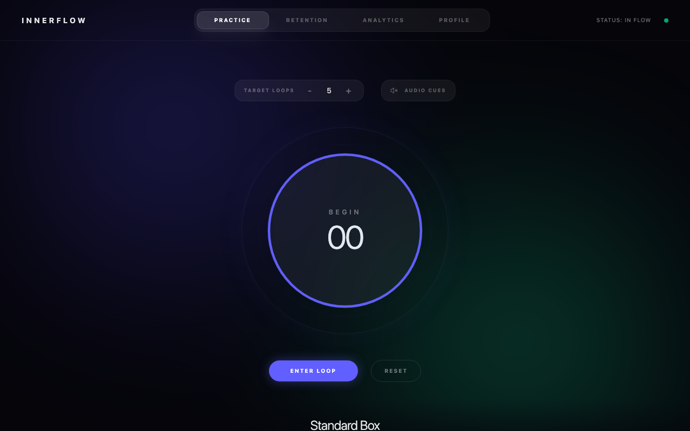
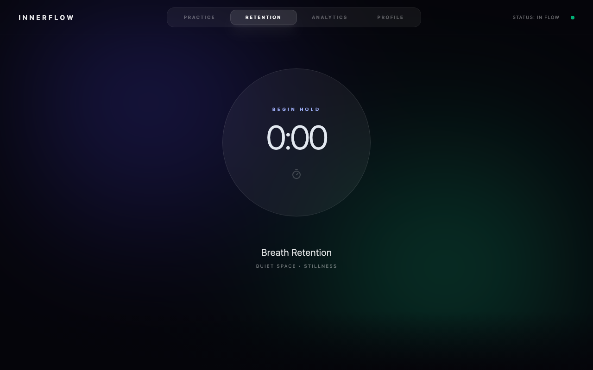
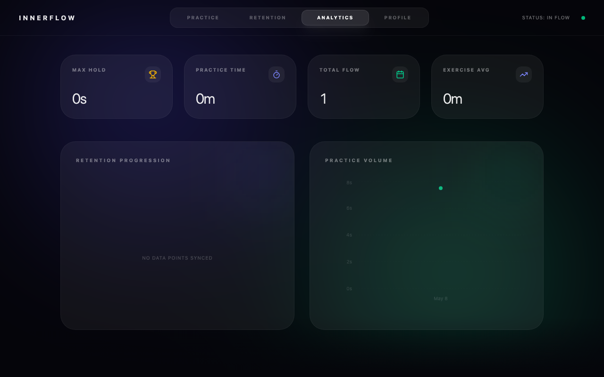

# Innerflow
> **Meditation in Motion • Neural Synchronization**

Innerflow is a high-performance breathwork application designed to help you achieve deep flow states, manage your autonomic nervous system, and optimize your mental energy through guided respiratory exercises.

Live Demo: [https://innerflow-598464211339.us-west2.run.app](https://innerflow-598464211339.us-west2.run.app)

---

## ⚡️ The Productivity Edge

True productivity isn't about working more; it's about managing the quality of your focus. Innerflow utilizes scientifically-backed breathing techniques to:
- **Reset the Nervous System**: Shift from "Fight or Flight" (Sympathetic) to "Rest and Digest" (Parasympathetic) in under 2 minutes.
- **Enhance Heart Rate Variability (HRV)**: Improve your physiological resilience to stress.
- **Build Mental Grit**: Use breath retention (CO2 tolerance training) to expand your comfort zone and improve focus under pressure.

---

## 🛠 Features

### 1. Practice (Guided Breathwork)
Choose from curated breathing patterns like **Box Breathing** for focus or **4-7-8** for deep relaxation. 
- **Difficulty Levels**: Beginner, Intermediate, and Advanced rhythms.
- **Visual Guidance**: An intuitive, expanding circle synchronized with your breath.
- **Audio Feedback**: Subtle cues to keep you in the rhythm without looking at the screen.

### 2. Retention (Breath-Hold Timer)
Track your maximum breath-hold duration to monitor your CO2 tolerance and respiratory health.
- **Manual Control**: Tap to start/stop the timer during your hold.
- **Progression Tracking**: See how your retention improves over time.

### 3. Analytics (Neural Progress)
Your data-driven dashboard for consistency and growth.
- **Session History**: Detailed logs of every practice and retention session.
- **Streak Tracking**: Stay accountable with visual progress markers.
- **Performance Trends**: Visualize your journey toward neural synchronization.

---

## 🚀 Getting Started

### Initialize Sequence
1.  Navigate to the [Live Demo](https://innerflow-598464211339.us-west2.run.app).
2.  Click **Continue with Email**.
3.  Use the test credentials:
    - **Email**: `test@test.com`
    - **Password**: `p@$$w0rd`
4.  Click **Initialize Sequence**.

### Local Development
1.  Clone the repository.
2.  Install dependencies: `npm install`.
3.  Start the engine: `npm run dev`.
4.  Build for production: `npm run build`.

---

## 🧬 Tech Stack
- **React 19**: Modern UI architecture.
- **Firebase**: Secure authentication and real-time data synchronization.
- **Motion**: High-performance fluid animations for breathing guidance.
- **Tailwind CSS v4**: Minimalist, utility-first styling.
- **Lucide React**: Clean, semantic iconography.

---

*Designed for high-performers, builders, and anyone looking to master their internal state.*
